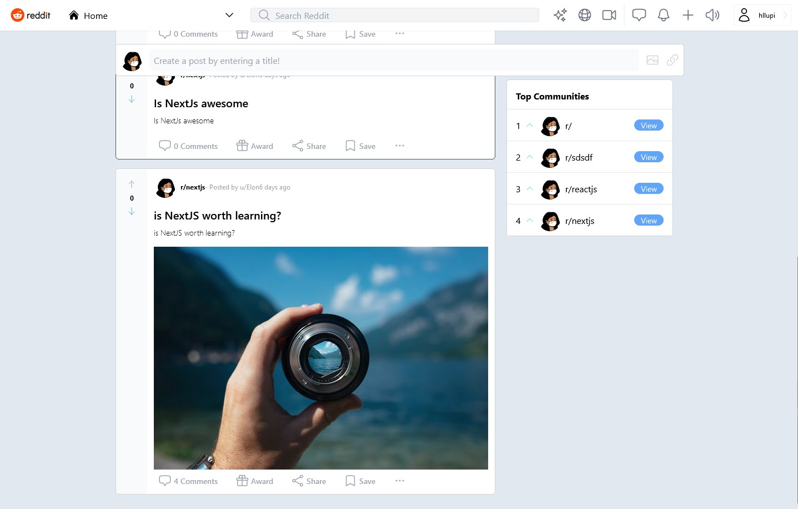

[![Contributors][contributors-shield]][contributors-url] [![Forks][forks-shield]][forks-url][![Stargazers][stars-shield]][stars-url][![Issues][issues-shield]][issues-url]
[![LinkedIn][linkedin-shield]][linkedin-url]

  

  <h3 align="center">Clone Reddit</h3>

  

    A lightweight reddit clone with a small set of features just to try out some technologies
     
     
    <a href="https://github.com/hlopes/clone-reddit">Explore the docs</a>
    ·
    <a href="https://github.com/hlopes/clone-reddit/issues">View Demo</a>
  

<!-- TABLE OF CONTENTS -->

  
Table of Contents

  <ol>
    <li><a href="#about-the-project">About The Project</a></li>
    <li><a href="#built-with">Built With</a></li>
    <li><a href="#acknowledgments">Acknowledgments</a></li>
  </ol>

<!-- ABOUT THE PROJECT -->

## About The Project

This project was created as a small platform to try out some technologies such as tailwind, stepzen/graphql and NextJs.

### Built With

The following list includes the major frameworks/libraries used to create project.

- [![Typescript][typescript]][typescript-url]
- [![React][react.js]][react-url]
- [![Next][next.js]][next-url]
- [![Tailwindcss][tailwindcss]][tailwindcss-url]
- [![Graphql][graphql]][graphql-url]
- [![Supabase][supabase]][supabase-url]

<!-- ACKNOWLEDGMENTS -->

## Acknowledgments

Use this space to list resources you find helpful and would like to give credit to. I've included a few of my favorites to kick things off!

- [Malven's Flexbox Cheatsheet](https://flexbox.malven.co/)
- [Img Shields](https://shields.io)
- [Heroicons](https://heroicons.com/)
- [React Hook Form](https://react-hook-form.com/)
- [React Hot Toast](https://react-hot-toast.com/)
- [React Timeago](https://github.com/nmn/react-timeago)
- [Next Auth](https://next-auth.js.org/)

(<a href="#readme-top">back to top</a>)

<!-- MARKDOWN LINKS & IMAGES -->
<!-- https://www.markdownguide.org/basic-syntax/#reference-style-links -->

[contributors-shield]: https://img.shields.io/github/contributors/hlopes/clone-reddit.svg?style=for-the-badge
[contributors-url]: https://github.com/hlopes/clone-reddit/graphs/contributors
[forks-shield]: https://img.shields.io/github/forks/hlopes/clone-reddit.svg?style=for-the-badge
[forks-url]: https://github.com/hlopes/clone-reddit/network/members
[stars-shield]: https://img.shields.io/github/stars/hlopes/clone-reddit.svg?style=for-the-badge
[stars-url]: https://github.com/hlopes/clone-reddit/stargazers
[issues-shield]: https://img.shields.io/github/issues/hlopes/clone-reddit.svg?style=for-the-badge
[issues-url]: https://github.com/hlopes/clone-reddit/issues
[license-shield]: https://img.shields.io/github/license/hlopes/clone-reddit.svg?style=for-the-badge
[license-url]: https://github.com/hlopes/clone-reddit/blob/master/LICENSE.txt
[linkedin-shield]: https://img.shields.io/badge/-LinkedIn-black.svg?style=for-the-badge&logo=linkedin&colorB=555
[linkedin-url]: https://linkedin.com/in/hugorodrigueslopes
[product-screenshot]: images/screenshot.png
[next.js]: https://img.shields.io/badge/next.js-000000?style=for-the-badge&logo=nextdotjs&logoColor=white
[next-url]: https://nextjs.org/
[react.js]: https://img.shields.io/badge/React-20232A?style=for-the-badge&logo=react&logoColor=61DAFB
[react-url]: https://reactjs.org/
[tailwindcss]: https://img.shields.io/badge/supabase-black?style=for-the-badge&logo=tailwindcss
[tailwindcss-url]: https://tailwindcss.com/
[typescript]: https://img.shields.io/badge/typescript-black?style=for-the-badge&logo=typescript
[typescript-url]: https://www.typescriptlang.org/
[graphql]: https://img.shields.io/badge/graphql-black?style=for-the-badge&logo=graphql
[graphql-url]: https://graphql.org/
[supabase]: https://img.shields.io/badge/supabase-black?style=for-the-badge&logo=supabase
[supabase-url]: https://supabase.com/
